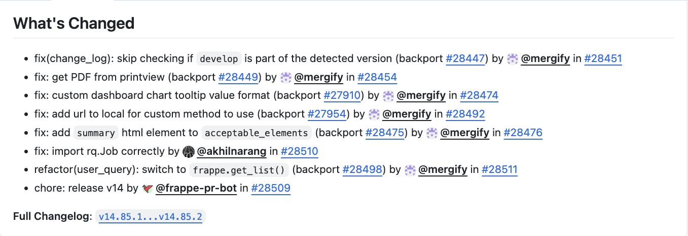
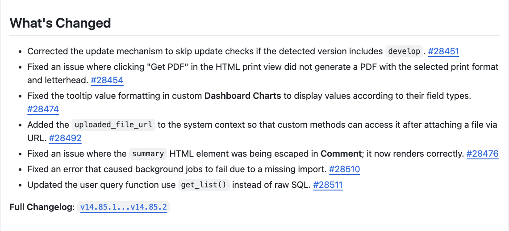

Turn GitHub's auto-generated release notes into human-readable sentences.

Converts this:



Into this:



Notice that:

- Commits that are inconsequential to the user are excluded (chore, ci, refactor).
- Each PR is converted into a precise sentence, based on it's title, description, diff and any linked issue.
- Each sentence has a consistent style and tense.
- Human authors and reviewers are credited, not bots.

UX:

https://github.com/user-attachments/assets/5d1dd513-b643-4f02-aac9-ba9c3f16d043


> [!WARNING]
> The prompt is geared towards [ERPNext](https://github.com/frappe/erpnext) and the [Frappe Framework](https://github.com/frappe/frappe). If you want to use this for different projects, please fork and adjust to your liking.

## Configuration

Copy `.env.example` to `.env` and fill in your GitHub token and OpenAI API key.

You can choose a database type by setting the `DB_TYPE` environment variable. Currently supported are `csv` and `sqlite`.

## Usage

### CLI

```bash
source env/bin/activate

python main.py --help
python main.py erpnext v15.38.4 # using DEFAULT_OWNER from .env
python main.py --owner alyf-de banking v0.0.1
```

Example output:

```markdown
---- Original ----
## What's Changed
* fix: list view and form status not same for purchase order (backport #43690) (backport #43692) by @mergify in https://github.com/frappe/erpnext/pull/43706


**Full Changelog**: https://github.com/frappe/erpnext/compare/v15.38.3...v15.38.4

---- Modified ----
## What's Changed
* Removes unnecessary decimal precision checks for _per_received_ and _per_billed_ fields in **Purchase Order**, so the list view status and form status remain consistent. https://github.com/frappe/erpnext/pull/43706


**Full Changelog**: https://github.com/frappe/erpnext/compare/v15.38.3...v15.38.4
**Authors**: @rohitwaghchaure
```

### Web API

The tool can also be run as a REST API server for integration with web frontends.

#### Starting the Server

First, install the web dependencies:

```bash
source env/bin/activate
pip install -r requirements-web.txt
```

Then start the server:

```bash
python -m uvicorn web.app:app --host 0.0.0.0 --port 8000
```

The API will be available at `http://localhost:8000` with interactive documentation at `http://localhost:8000/docs`.

#### API Endpoints

**Health Check**
```bash
curl http://localhost:8000/health
```

**Create Release Notes Job**
```bash
curl -X POST http://localhost:8000/generate \
  -H "Content-Type: application/json" \
  -d '{
    "owner": "frappe",
    "repo": "erpnext",
    "tag": "v15.38.4",
    "github_token": "ghp_your_token_here",
    "openai_key": "sk-your_key_here",
    "openai_model": "gpt-4",
    "exclude_types": ["chore", "ci", "refactor"],
    "exclude_labels": ["skip-release-notes"],
    "exclude_authors": ["dependabot[bot]"]
  }'
```

Response:
```json
{
  "job_id": "550e8400-e29b-41d4-a716-446655440000",
  "status": "pending",
  "created_at": "2025-01-19T10:30:00.000000"
}
```

**Check Job Status**
```bash
curl http://localhost:8000/jobs/{job_id}
```

Response:
```json
{
  "job_id": "550e8400-e29b-41d4-a716-446655440000",
  "status": "completed",
  "created_at": "2025-01-19T10:30:00.000000",
  "completed_at": "2025-01-19T10:30:15.000000",
  "result": "## What's Changed\n* Fixed bug...",
  "progress": [
    {
      "timestamp": "2025-01-19T10:30:05.000000",
      "type": "success",
      "message": "Downloaded PRs in 0.42 seconds."
    }
  ],
  "error": null
}
```

## Authors and Reviewers

The authors and reviewers of the PRs are added to the release notes.

- An author who reviewed or merged their own PR or backport is not a reviewer.
- A non-author who reviewed or merged someone else's PR is a reviewer.
- The author of the original PR is also the author of the backport.

## Backports

We try to use the same message for backports as for the original PR. For this, we look for `(backport #<number>)` _at the end_ of the PR title and check if we have existing messages for that PR in our database. If we do, we use the message for the original PR. If we don't, we create a new message for the backport.

This means that backports of backports are currently not supported / will get a new message. To get the same message, PRs must be a direct backport of the original PR.

## Testing

```bash
pytest tests/*
```
