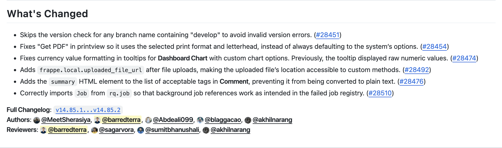

Turn GitHub's auto-generated release notes into human-readable sentences.

Converts this:


Into this:



Notice that:

- Commits that are inconsequential to the user are excluded (chore, ci, refactor).
- Each PR is converted into a precise sentence, based on it's title, description, diff and any linked issue.
- Each sentence has a consistent style and tense.
- Human authors and reviewers are credited, not bots.

UX:

https://github.com/user-attachments/assets/5d1dd513-b643-4f02-aac9-ba9c3f16d043


> [!WARNING]
> The prompt is geared towards [ERPNext](https://github.com/frappe/erpnext) and the [Frappe Framework](https://github.com/frappe/frappe). If you want to use this for different projects, please fork and adjust to your liking.

## Configuration

Copy `.env.example` to `.env` and fill in your GitHub token and OpenAI API key.

You can choose a database type by setting the `DB_TYPE` environment variable. Currently supported are `csv` and `sqlite`.

## Usage

### CLI Mode (Original)

```bash
source env/bin/activate

python main.py --help
python main.py erpnext v15.38.4 # using DEFAULT_OWNER from .env
python main.py --owner alyf-de banking v0.0.1
```

### Webhook Mode (New)

The webhook server allows automatic generation of release notes when a GitHub release is published.

#### Setup

1. **Configure Environment Variables**:
   Copy `.env.example` to `.env` and configure:
   ```bash
   GH_TOKEN=your_github_token_here
   OPENAI_API_KEY=your_openai_api_key_here
   OPENAI_MODEL=gpt-4o
   WEBHOOK_SECRET=your_webhook_secret_here
   PORT=5000
   ```

2. **Start the Webhook Server**:
   ```bash
   python webhook_server.py
   ```

3. **Configure GitHub Webhook**:
   - Go to your repository Settings → Webhooks
   - Add webhook with URL: `https://your-domain.com/webhook`
   - Set Content type: `application/json`
   - Set Secret: (same as WEBHOOK_SECRET in .env)
   - Select events: `Releases`
   - Ensure webhook is Active

#### How It Works

1. When a release is **published** on GitHub, GitHub sends a webhook to your server
2. The server verifies the webhook signature for security
3. It extracts the release information and uses the existing ReleaseNotesGenerator
4. AI-generated release notes are automatically created and updated on the GitHub release

#### Webhook Endpoints

- `POST /webhook` - Main webhook receiver for GitHub events
- `GET /health` - Health check endpoint
- `GET /` - Service status and information

#### Security

- **Webhook Secret**: Always configure `WEBHOOK_SECRET` to verify webhook authenticity
- **HTTPS**: Use HTTPS in production to protect webhook payloads
- **GitHub Token**: Use a token with minimal required permissions (`Contents` and `Metadata`)

#### Deployment

For production deployment, consider:

- **Reverse Proxy**: Use nginx or similar to handle SSL termination
- **Process Manager**: Use supervisord, systemd, or similar to manage the process
- **Monitoring**: Monitor the `/health` endpoint for service availability
- **Logs**: Configure proper log aggregation and monitoring

Example nginx configuration:
```nginx
server {
    listen 443 ssl;
    server_name your-domain.com;
    
    ssl_certificate /path/to/cert.pem;
    ssl_certificate_key /path/to/key.pem;
    
    location /webhook {
        proxy_pass http://localhost:5000;
        proxy_set_header Host $host;
        proxy_set_header X-Real-IP $remote_addr;
        proxy_set_header X-Forwarded-For $proxy_add_x_forwarded_for;
        proxy_set_header X-Forwarded-Proto $scheme;
    }
}
```

#### Environment Variables

| Variable | Required | Description |
|----------|----------|-------------|
| `GH_TOKEN` | Yes | GitHub personal access token |
| `OPENAI_API_KEY` | Yes | OpenAI API key |
| `OPENAI_MODEL` | Yes | OpenAI model (e.g., gpt-4o) |
| `WEBHOOK_SECRET` | Recommended | Secret for webhook signature verification |
| `PORT` | No | Server port (default: 5000) |
| `DEBUG` | No | Enable debug mode (default: false) |
| `PROMPT_PATH` | No | Path to prompt template (default: prompt.txt) |
| `MAX_PATCH_SIZE` | No | Maximum patch size (default: 10000) |
| `DB_TYPE` | No | Database type (default: sqlite) |
| `EXCLUDE_PR_TYPES` | No | Comma-separated PR types to exclude |
| `EXCLUDE_PR_LABELS` | No | Comma-separated labels to exclude |
| `EXCLUDE_AUTHORS` | No | Comma-separated authors to exclude |

#### Error Handling

The webhook server includes comprehensive error handling:

- **Signature Verification**: Rejects webhooks with invalid signatures
- **Payload Validation**: Validates JSON structure and required fields
- **GitHub API Errors**: Handles rate limits and API failures gracefully
- **OpenAI API Errors**: Retries and fallback handling for AI generation
- **Logging**: Detailed logs for monitoring and debugging

Example output:

```markdown
---- Original ----
## What's Changed
* fix: list view and form status not same for purchase order (backport #43690) (backport #43692) by @mergify in https://github.com/frappe/erpnext/pull/43706


**Full Changelog**: https://github.com/frappe/erpnext/compare/v15.38.3...v15.38.4

---- Modified ----
## What's Changed
* Removes unnecessary decimal precision checks for _per_received_ and _per_billed_ fields in **Purchase Order**, so the list view status and form status remain consistent. https://github.com/frappe/erpnext/pull/43706


**Full Changelog**: https://github.com/frappe/erpnext/compare/v15.38.3...v15.38.4
**Authors**: @rohitwaghchaure
```

## Authors and Reviewers

The authors and reviewers of the PRs are added to the release notes.

- An author who reviewed or merged their own PR or backport is not a reviewer.
- A non-author who reviewed or merged someone else's PR is a reviewer.
- The author of the original PR is also the author of the backport.


## Testing

```bash
pytest tests/*
```
